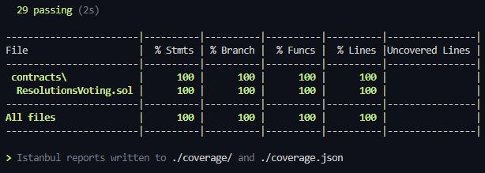
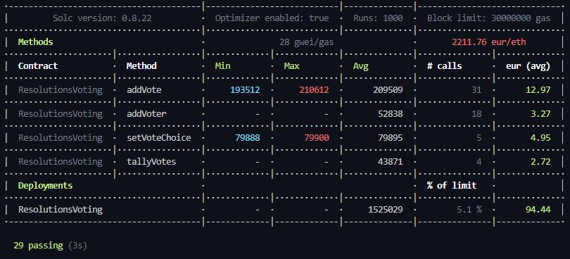

# Projet final : Systeme de vote programmable.

## Pour correction :
1. **Lien vidéo:** 
2. **Lien Déploiement:** https://rn-last-project-alyra-2023.vercel.app/

## Groupe constitué de :
- Nacim Rabia

**Niveaux bonnes pratiques:**
NATSPEC comments are implemented in ResolutionsVoting.sol.

## Bellow the tests reports

## 1 - Code coverage
</img>

## 2 - Gas report
</img>

## Technologies:
Voici la liste de la stack utilisée pour la réalisation du projet

- Solidity
- Openzeppelin
- Alchemy provider
- Vercel
- PostGresql (DB)
- Prisma (ORM)
- Hardhat
- Next.js
- NextAuth
- TypeScript
- Wagmi
- Viem
- Web3Modal
- TailwindCss
- ShadCn-UI
- Eslint
- Sign-With-Ethereum
- Crypto.Js (AES Encryption)
- Zod

## Setup project

## 1 - Front

  1 - Clone the project
  ```shell
  git clone https://github.com/Alyra-school/rn-project-final
  ```

  2 - Install dependencies
  ```shell
  cd rn-project-final/front
  npm i
  ```

  2 - Run the front
  ```shell
  npm run dev
  ```

## 2 - Back

  1 - Install dependencies
  ```shell
  cd rn-project-final/back
  npm i
  ```

  2 - Run the HardHat BC (Node BC)
  ```shell
  npm run local-bc
  ```

  4 - Deploy the voting contract
  ```shell
  npm run deploy-localhost
  ```

> **Note**  
> If you want to use the CoinMarketCap API for Gas estimation, you must fill in the missing information in the .env file.

> **Important**  
> Please don't commit .env with your sensitive information.n
